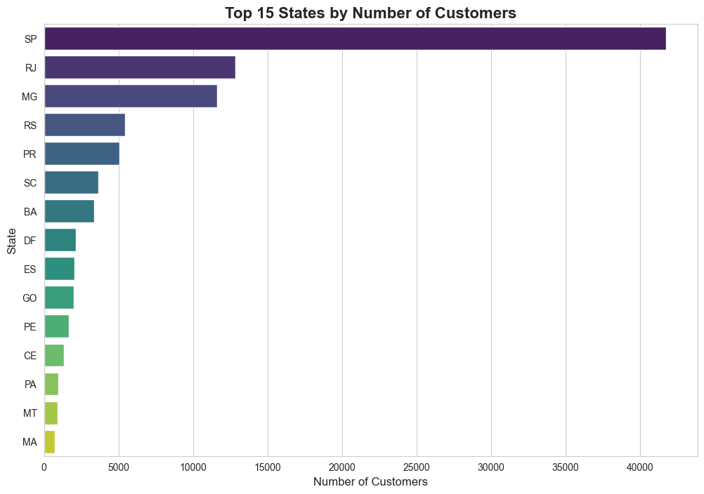

# Brazilian E-commerce Public Dataset Analysis

## 🎯 Objective
This project analyzes a public dataset from a Brazilian e-commerce platform to uncover business insights related to customers, products, and sales performance. The goal is to answer key business questions using Python, Pandas, and SQL.

## 📦 Data Source
The data is from the "Brazilian E-commerce Public Dataset by Olist," available on [Kaggle](https://www.kaggle.com/datasets/olistbr/brazilian-ecommerce). It contains information about orders, products, customers, and reviews.

## 🛠️ Project Workflow
The project is structured as a series of Python scripts, executed in order:

1.  **`01_create_database.py`**: Reads the 9 raw CSV files from the `/data` directory and loads them into a centralized SQLite database (`olist.db`).
2.  **`02_customer_analysis.py`**: Queries the database to analyze the geographic distribution of customers.
3.  **`03_product_revenue_analysis.py`**: Identifies the top 10 most profitable product categories.
4.  **`04_satisfaction_analysis.py`**: Analyzes the correlation between delivery times and customer review scores.
5.  **`05_visualize_customer_distribution.py`**: Generates a bar chart visualizing the top 15 states by customer count.

## 📊 Key Findings & Visualizations

### Customer Distribution by State
The analysis shows that the customer base is heavily concentrated in the state of São Paulo (SP), followed by Rio de Janeiro (RJ) and Minas Gerais (MG). This visualization highlights key markets.

### Key Insights
* **Top Product Categories by Revenue:** The most profitable categories are `beleza_saude` (Health & Beauty), `relogios_presentes` (Watches & Gifts), and `cama_mesa_banho` (Bed, Bath & Table).
* **Satisfaction vs. Delivery Time:** There is a strong negative correlation between delivery time and satisfaction. Orders with a 1-star review take, on average, twice as long to arrive as orders with a 5-star review.

## 💻 Technologies Used
- Python
- Pandas
- SQLAlchemy
- Matplotlib & Seaborn
- SQLite